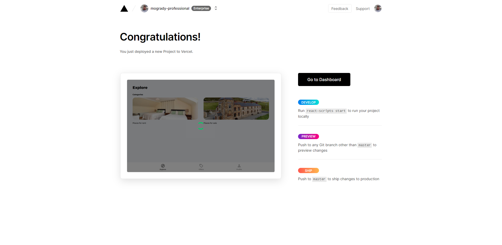
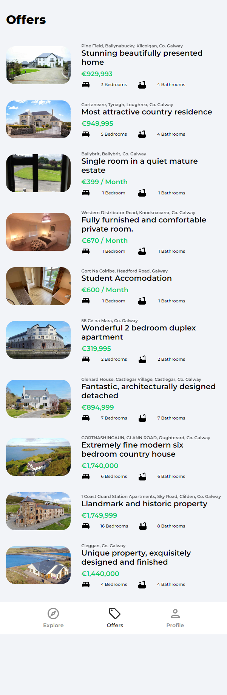
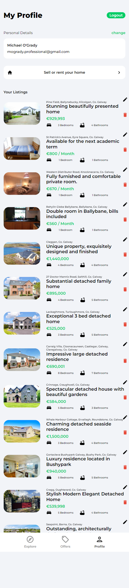
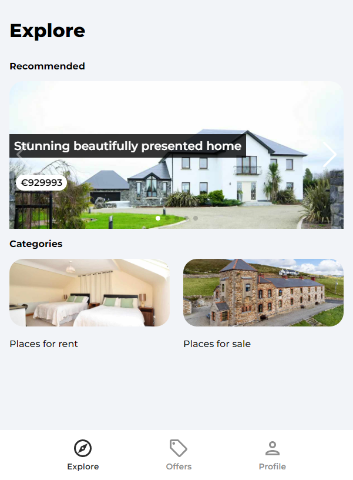
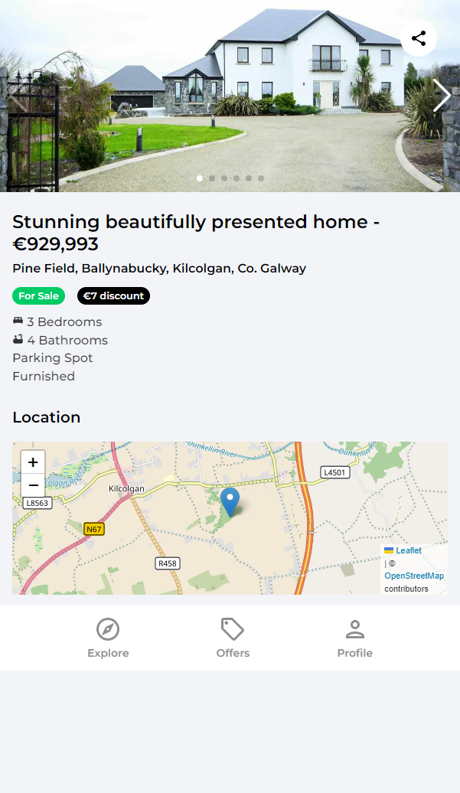
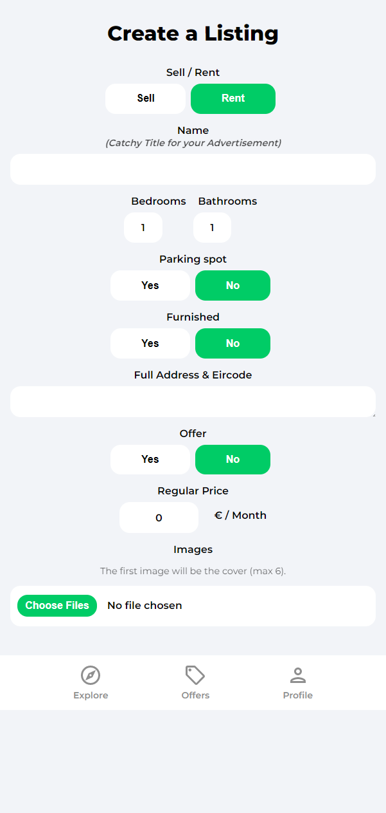
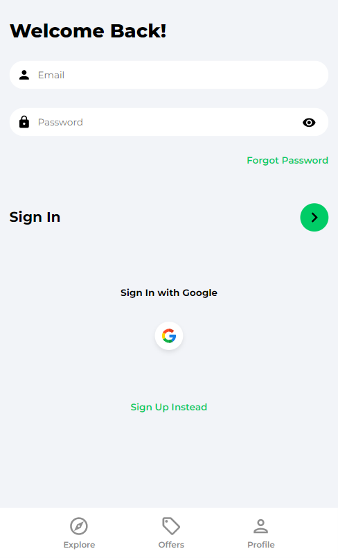
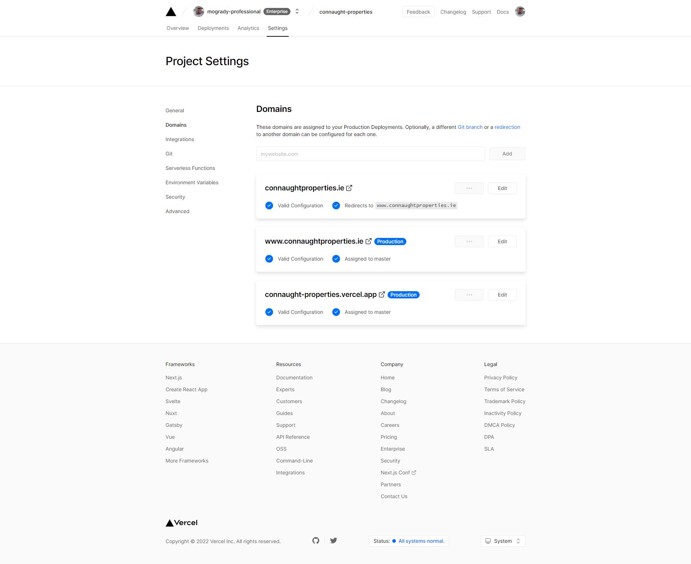

# Connaught Properties

<p align="center">
 
</p>

# Table of Contents

- [Connaught Properties](#connaught-properties)
- [Table of Contents](#table-of-contents)
- [Project Overview](#project-overview)
  - [Features](#features)
  - [Getting Started Commands](#getting-started-commands)
  - [Notes](#notes)
  - [Packages Used](#packages-used)
  - [Config File for Google Firebase](#config-file-for-google-firebase)
- [Firebase Setup For House Marketplace](#firebase-setup-for-house-marketplace)
- [Production Vercel Deployment Notes](#production-vercel-deployment-notes)
  - [CEL — Common Expression Language](#cel--common-expression-language)
    - [Cloud Firestore](#cloud-firestore)
    - [Storage Rules](#storage-rules)
- [Screenshots](#screenshots)

# Project Overview

- [x] React Router DOM V6
- [x] Firebase 9
- [x] Project Hosted on Vercel
- The way that Firebase stores your authentication in the browser is through IndexedDB.
  - Go to application, it's not going to be in regular local storage. Around version 5 of Firebase they moved it to IndexedDB. Look for IndexedDB, you'll see Firebase local storage. What's great about Firebase is you don't have to worry about every refresh like you would if you are implementing a custom backend with with JSON Web tokens.

## Features

- [x] Mobile First Design
- [x] Firebase Web App
- [x] Firestore Database
- [x] Google Geocoding for Address Mapping
- [x] Authentication — OAuth Google Login, Password Reset & Traditional Username/Password
- [x] React Toastify Icons
- [x] Custom Hook
  - [x] useAuthStatus
- [x] Private Route — User Login - Check Status
- [x] [uuid](https://www.npmjs.com/package/uuid) -> used to assist naming unique id's of uploaded images
- [x] [React Leaflet](https://react-leaflet.js.org/docs/api-map/) added for maps functionality
- [x] [React Swiper](https://swiperjs.com/react) added for image swiping functionality
  - [x] Pagination used to call 10 advertisements instead of auto loading all listings
- [x] Deployed on Vercel
- [x] Custom Domain

## Getting Started Commands

- `npx create-react-app connaught-properties --use-npm`
- `npm install firebase`
- `npm install react-router-dom`

## Notes

- To save images you need an ID, use [uuid](https://www.npmjs.com/package/uuid) to give a unique ID to each image
  - `npm i uuid`

## Packages Used

- [x] [React Toastify](https://fkhadra.github.io/react-toastify/)

## Config File for Google Firebase

- Create a `firebase.config.js` file in the src folder

# Firebase Setup For House Marketplace

1. Create Firebase Project
2. Create "web" app within firebase to get config values"
3. Install firebase in your project "npm i firebase
4. Create a config file in your project
5. Add authentication for email/password and Google
6. Create a user from Firebase
7. Enable Firestore
8. Add rules for firestore (see Rule a below)
9. Enable storage
10. Add rules for storage (see Rule b below)
11. Create 3 composite indexes for advanced querying

# Production Vercel Deployment Notes

- Connect project to GitHub repo
- Provide `REACT_APP_GEOCODE_API_KEY` ENV Variable to Vercel
- Google OAuth — Published Domain URL(s) must be added to OAuth Redirect domains in firebase console/authentication/sign in method/ Authorized domains
- Geocoding API — Add Application Restrictions (Restrict key usage requests to the specified website)
- `A Runtime Error Occurred e is not a function` error will occur on Vercel dashboard if there is a mismatch with `Credentials` / `API Keys` section of API's and Services in GCP relating to the Geolocation and OAuth Functionality as well as a failed login and possible dns issue on initial settings update for 5 minutes.

## CEL — Common Expression Language

Rules for Google Firestore

- Listing Collection
- Users Collection

> Allow read (no authentication required, but to create listings you must be logged in and no more then 7 images can be updated; upload for user listing only; to update it must be the logged in user

### Cloud Firestore

```
// Rule a
// FIRESTORE RULES

rules_version = '2';
service cloud.firestore {
  match /databases/{database}/documents {
    // Listings
    match /listings/{listing} {
    	allow read;
      allow create: if request.auth != null && request.resource.data.imgUrls.size() < 7;
    	allow delete: if resource.data.userRef == request.auth.uid;
      allow update: if resource.data.userRef == request.auth.uid;
    }

    // Users
    match /users/{user} {
    	allow read;
    	allow create;
    	allow update: if request.auth.uid == user
    }
  }
}
```

### Storage Rules

> Allow read of images; Conditions: user must be logged in; ensure images are under 2MB; ensure the images are PNG, JPEG, or GIF

```
// STORAGE RULES

rules_version = '2';
service firebase.storage {
  match /b/{bucket}/o {
    match /{allPaths=**} {
      allow read;
      allow write: if
      request.auth != null &&
      request.resource.size < 2 * 1024 * 1024 && //2MB
      request.resource.contentType.matches('image/.*')
    }
  }
}
```

- Create Indexes

  - Composite Index'es
    - Collection ID : listings
      - `type`: `Ascending`
      - `timestamp` : `Descending`
    - Query Scope
      Collection
    - Collection ID : listings
      - `type`: `Ascending`
      - `timestamp` : `Descending`
    - Collection ID : listings
      - `offer`: `Ascending`
      - `timestamp` : `Descending`

- The way that Firebase stores your your authentication in the browser is through IndexedDB.
  - Go to application, it's not going to be in like your regular local storage. I believe it was like version five of Firebase that they moved it to IndexedDB. Look for IndexedDB, you'll see Firebase local storage and that's what's great about Firebase is you don't have to worry about every refresh like you would if you are implementing a custom backend with with JSON Web tokens.

# Screenshots

<p align="center">
</p>
<table>
  <tr>
      <h2>Offers</h2>
    
  </tr>
  <tr>
  <h2>My Profile</h2>
    
  </tr>
  <tr>
      <h2>Explore</h2>

  </tr>
  <tr>
  <h2>Listing</h2>

  </tr>
  <tr>
  <h2>Sign In Mobile</h2>

  </tr>
  <tr>
  <h2>Log In</h2>

  </tr>
</table>
<p align="center">
 
</p>
